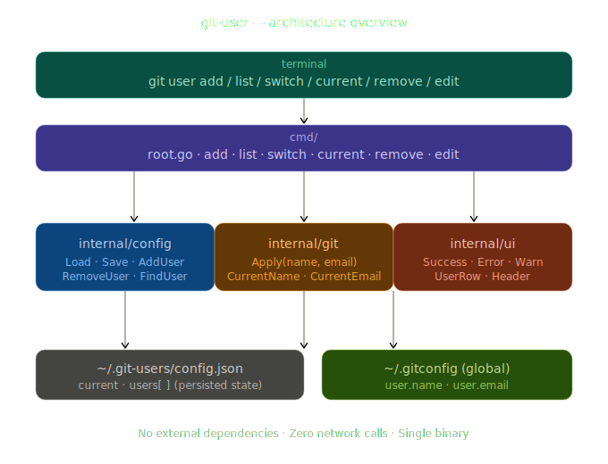

# git-user

> Manage and switch between multiple Git identities — including SSH keys and platform accounts — in one command.

---

## Why git-user?

| Problem | Solution |
|---|---|
| Multiple people share one machine | Named identities — switch in one command |
| Office vs personal accounts | Add both, switch globally or per-repo |
| Different SSH keys per platform account | Keyed per-user, applied automatically on switch |
| Managing ~/.ssh/config by hand | Managed blocks written and updated automatically |
| Forgetting which account is active | git user current cross-checks everything |
| CLI is too complex | **Interactive TUI** — complete management in one menu |

### ✨ Enhanced TUI Experience
The new `git-user` features a premium, terminal-optimized UI powered by **Lipgloss**. Expect:
- **Gradient Banners**: Visual clarity for current operations.
- **User Cards**: Rounded-corner cards for viewing identities.
- **Interactive Select**: Arrow-key navigation for switching and management.

### Who is this for? (Use Cases)

**The Freelancer**
"I work with three different clients. Each client wants me to use a specific email and SSH key for their repositories. With `git-user`, I just run `git user switch client-a` before I start working, and I'm ready to go."

**The Open Source Contributor**
"I use my company email for work, but I want to use my personal email for my side projects on GitHub. `git-user` makes sure I never leak my work email onto my public profile by accident."

---

## Table of Contents

- [Installation](#installation)
- [Terminology for Beginners](#terminology-for-beginners)
- [Architecture Overview](#architecture-overview)
- [Phase 1 — Identity switching](#phase-1--identity-switching)
- [Phase 2 — SSH keys and platform accounts](#phase-2--ssh-keys-and-platform-accounts)
- [Command reference](#command-reference)
- [Security practices](#security-practices)
- [Project structure](#project-structure)

---

## Installation

### Prerequisites

- Go 1.21+
- git on PATH
- ssh / ssh-keygen on PATH

### One-Command Install (Recommended)

Run this in your terminal to download, build, and install the latest version automatically:

```bash
curl -sSfL https://raw.githubusercontent.com/divyo-argha/git-user/main/installer.sh | bash
```

### Manual Build

```bash
git clone https://github.com/divyo-argha/git-user
cd git-user
make install-local          # Installs to ~/bin/git-user
```

---

## Terminology for Beginners

If you're new to Git, some of these terms might be confusing. Here's a quick guide:

- **SSH Keys**: Think of these as a "digital key" that identifies you to GitHub. Each account should have its own key for security.
- **Global Config**: These are the default name and email Git uses for every project you work on. `git-user` manages these for you automatically.
- **Identity (or User)**: A named "profile" that contains a specific name, email, and SSH key.

---

## Architecture Overview

`git-user` is designed for zero-friction switching. It manages a local state file and interacts with your global Git configuration to keep your identities in sync.



---

## Phase 1 — Identity switching

```bash
# Register identities interactively (Simplified)
git user register

# Or traditional manual add
git user add work  alice@example.com
git user add home  alice@personal.com

# Bind SSH keys
git user bind work --ssh-key ~/.ssh/id_ed25519_work

# Switch contexts interactively
git user -i

# Create and switch in one step (Git-style)
git user switch -c work alice@example.com
```

---

## 🎮 Interactive Mode (TUI)
Run `git user -i` or `git user tui` to open the interactive dashboard. From here you can:
- **Switch** between users with arrow keys.
- **Register** new identities with a unified setup flow.
- **Bind** SSH or Signing keys without remembering flags.
- **Remove** old identities safely.

---

## Phase 2 — SSH keys and platform accounts (Roadmap)

### How SSH handling works

When using Phase 2 features (currently in development), `git-user` manages blocks in your `~/.ssh/config`:

```
# git-user:begin github-work
Host github-work
    HostName github.com
    User git
    IdentityFile ~/.ssh/id_ed25519_work
    IdentitiesOnly yes
    AddKeysToAgent yes
# git-user:end github-work
```

### Advanced Workflow

```bash
# Map platform accounts
git user platform add work github  alice-corp

# Clone using aliases
git clone git@github-work:org/repo.git
```

---

## 🐚 Plug & Play Shell Prompt

Keep track of your active identity directly in your terminal prompt with zero manual setup.

### Quick Setup
Simply run:
```bash
git-user setup-prompt
```
This automatically detects your shell (Zsh/Bash), updates your config file, and shows your active profile on the right side of your prompt.

### How to Remove
If you want to remove the integration, just run:
```bash
git-user remove-prompt
```

---

## Command reference

| Command | Usage | Description |
| :--- | :--- | :--- |
| **register** | `git user register` | **Preferred**: Unified setup for name, email + SSH |
| **tui** | `git user tui` (or `-i`) | Open the interactive management menu |
| **add** | `git user add <name> <email>` | Create a new profile manually |
| **list** | `git user list` | Show all your profiles in card view |
| **switch** | `git user switch [-c] <n> [e]` | Activate (or create and activate) a profile |
| **current**| `git user current` | See which profile is active |
| **bind** | `git user bind <n> --ssh-key <p>`| Link an SSH key to a profile |
| **remove** | `git user remove <name>` | Delete a profile from the store |
| **edit** | `git user edit <name> <email>` | Update identity email |

---

## Security practices

| Practice | Implementation |
|---|---|
| No plaintext secrets | Only the path to the private key is stored; the key never moves |
| Key permission check | ValidateKeyFile refuses keys wider than 0600 |
| Atomic writes | Temp file + rename — no partial-write window |
| IdentitiesOnly yes | Prevents SSH trying other keys by accident |
| Empty passphrase warning | installer tells you how to add one afterward |

---

## Project structure

```
git-user/
├── main.go
├── Makefile
├── installer.sh
├── README.md
├── cmd/
│   ├── root.go          dispatcher + usage
│   ├── add.go
│   ├── list.go
│   ├── switch.go        applies identity on switch
│   ├── current.go
│   ├── remove.go
│   ├── edit.go
│   └── bind.go          links SSH keys
└── internal/
    ├── config/config.go store CRUD
    ├── git/git.go       git config wrapper
    ├── sshconf/sshconf.go ssh config manager
    └── ui/ui.go         ui helpers
```

---

## License

Distributed under the MIT License. See `LICENSE` for details.

---
<p align="center">
  Built for developers who value speed and simplicity.
</p>
