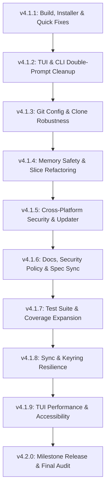

# 10-Release Progressive Refactoring & Bug-Fix Roadmap

This plan divides all identified issues, refactoring goals, test coverage improvements, and cross-platform enhancements into a structured **10-release sequence** (v4.1.1 through v4.2.0).

---

## Release Schedule & Scope Overview

---

## 📦 Detailed Release Breakdown

### Release 1 (v4.1.1): Critical Build, Installer & Quick Fixes
> **Focus:** Unblock builds, fix distribution installer, resolve active self-email bug.

- [ ] **[Makefile](file:///Users/bobdylan/Divyo/git-user/Makefile#L10)**: Fix `make build` target by changing `.` to `./cmd/git-user`.
- [ ] **[install.sh](file:///Users/bobdylan/Divyo/git-user/install.sh#L30)**: Add `grep -i` flag for case-insensitive release tarball matching (`Darwin`/`Linux`).
- [ ] **[edit.go](file:///Users/bobdylan/Divyo/git-user/internal/cli/edit.go#L31-L34)**: Exclude current user when checking `IsEmailTaken` during email updates.
- [ ] **[doctor.go](file:///Users/bobdylan/Divyo/git-user/internal/cli/doctor.go#L29-L112)**: Fix 6 command output string typos (`git user` → `git-user`).
- [ ] **Cleanup**: Delete stale committed artifact [npm/git-userhub-3.1.2.tgz](file:///Users/bobdylan/Divyo/git-user/npm/git-userhub-3.1.2.tgz).

---

### Release 2 (v4.1.2): TUI & CLI Double-Prompt & UX Cleanup
> **Focus:** Eliminate UX friction, fix misleading prompt hints.

- [ ] **[tui.go](file:///Users/bobdylan/Divyo/git-user/internal/cli/tui.go#L109-L112)** & **[tui.go](file:///Users/bobdylan/Divyo/git-user/internal/cli/tui.go#L184-L187)**: Bypass redundant terminal `ui.Confirm` prompt for `unbind` and `remove` actions initiated from TUI modal.
- [ ] **[passphrase.go](file:///Users/bobdylan/Divyo/git-user/internal/cli/passphrase.go#L136)**: Remove phantom reference to non-existent `git-user session start` command.
- [ ] **[pubkey.go](file:///Users/bobdylan/Divyo/git-user/internal/cli/pubkey.go#L26-L35)**: Fix contradictory error messages when passing identity name (`pubkey <name>`).
- [ ] **[root.go](file:///Users/bobdylan/Divyo/git-user/internal/cli/root.go#L127)**: Add `--version` / `-v` handling in `root.go` router for programmatic/test execution.

---

### Release 3 (v4.1.3): Git Configuration & Remote Handling Robustness
> **Focus:** Enhance URL handling, preserve clone arguments, path normalization.

- [ ] **[git.go](file:///Users/bobdylan/Divyo/git-user/internal/git/git.go#L250-L267)**: Update `ConvertHTTPSToSSH` to strip user credentials (`user@host`) before host parsing.
- [ ] **[clone.go](file:///Users/bobdylan/Divyo/git-user/internal/cli/clone.go#L103-L106)**: Preserve extra `git clone` arguments (e.g. `--depth 1`, `--branch`) in `cloneArgs`.
- [ ] **[bindpath.go](file:///Users/bobdylan/Divyo/git-user/internal/cli/bindpath.go#L91-L102)**: Normalize paths in `runUnbindPath` to support tilde (`~`), relative, and deleted paths.

---

### Release 4 (v4.1.4): Memory Safety & Slice Header Refactoring
> **Focus:** Clean up slice mutations and internal slice header aliasing risks.

- [ ] **[config.go](file:///Users/bobdylan/Divyo/git-user/internal/config/config.go#L313-L320)**: Refactor `UnbindPathFromUser` to allocate new slice instead of `u.BindPaths[:0]` during `range`.
- [ ] **[config.go](file:///Users/bobdylan/Divyo/git-user/internal/config/config.go#L199-L205)**: Refactor `RemoveUser` slice filtering to avoid in-place range mutation.
- [ ] **[remove.go](file:///Users/bobdylan/Divyo/git-user/internal/cli/remove.go#L14-L22)**: Refactor argument filtering slice re-slicing.

---

### Release 5 (v4.1.5): Cross-Platform Security & Updater Reliability
> **Focus:** Harden security mechanisms and Windows file operations.

- [ ] **[update.go](file:///Users/bobdylan/Divyo/git-user/internal/cli/update.go#L107-L115)**: Create temp binary file in target executable directory to prevent cross-device drive rename errors on Windows.
- [ ] **[utils.go](file:///Users/bobdylan/Divyo/git-user/internal/cli/utils.go#L82-L95)**: Pass passphrase directly (`-N passphrase`) into `ssh-keygen` to ensure keys are encrypted immediately upon creation.
- [ ] **Permissions Audit**: Audit all temp file creations across `internal/cli` to guarantee `0600` file modes.

---

### Release 6 (v4.1.6): Documentation & Policy Synchronization
> **Focus:** Keep security policy, shell integration guides, and package specs up to date.

- [ ] **[SECURITY.md](file:///Users/bobdylan/Divyo/git-user/SECURITY.md#L9)**: Update supported versions table to `4.x`.
- [ ] **[README.md](file:///Users/bobdylan/Divyo/git-user/README.md)**: Update command examples, aliases, and feature lists.
- [ ] **[TERMINAL-INTEGRATION.md](file:///Users/bobdylan/Divyo/git-user/TERMINAL-INTEGRATION.md)**: Verify prompt integration snippet scripts for zsh/bash/fish.
- [ ] **[npm/package.json](file:///Users/bobdylan/Divyo/git-user/npm/package.json)**: Verify wrapper package configuration and optional dependency specs.

---

### Release 7 (v4.1.7): Test Suite & Coverage Expansion
> **Focus:** Elevate test coverage across TUI components, CLI handlers, and edge cases.

- [ ] **[internal/tui](file:///Users/bobdylan/Divyo/git-user/internal/tui/app_test.go)**: Add test cases for TUI app state transitions and screen pushes.
- [ ] **[internal/cli](file:///Users/bobdylan/Divyo/git-user/internal/cli)**: Add unit tests for `export`/`import`, `clone`, and `stats` subcommands.
- [ ] **Coverage Goal**: Increase total project statement coverage from 39.8% to 65%+.

---

### Release 8 (v4.1.8): Auto-Sync & Keyring Resilience
> **Focus:** Auto-recovery for cloud sync and robust keyring handling.

- [ ] **[sync.go](file:///Users/bobdylan/Divyo/git-user/internal/cli/sync.go#L117)**: Automatically initialize or re-clone `syncDir` (`~/.git-users/sync`) if local sync directory is missing.
- [ ] **[keyring](file:///Users/bobdylan/Divyo/git-user/internal/keyring)**: Improve fallback messages when OS keychain is unavailable (headless Linux, SSH sessions).

---

### Release 9 (v4.1.9): TUI Polish, Accessibility & Keyboard Nav
> **Focus:** Polish visual presentation, keyboard shortcuts, and responsive terminal layout.

- [ ] **[tui/components](file:///Users/bobdylan/Divyo/git-user/internal/tui/components)**: Add keyboard shortcuts (`g`/`G`, page up/down) in identity lists.
- [ ] **Theme & Colors**: Enhance color contrast for light vs. dark terminal backgrounds.
- [ ] **Status & Toast**: Add smooth auto-dismiss and queue management for multiple toast alerts.

---

### Release 10 (v4.2.0): Milestone Release & End-to-End Audit
> **Focus:** Final verification, multi-platform smoke test, major release tag.

- [ ] **Cross-Platform Verification**: Perform automated build and test passes across macOS (ARM64/x64), Linux (x64/ARM64), and Windows (x64/ARM64).
- [ ] **Performance & Binary Audit**: Verify binary size optimization (`-s -w` ldflags), clean release notes, tag `v4.2.0`.
- [ ] **npm Release**: Trigger automated `npm-publish.yml` workflow with Sigstore provenance.

---

## Verification Plan

### Automated Testing
- `go test ./...` (Verify unit tests pass for each release)
- `make test` (Run full test runner & coverage checker)
- `node npm/scripts/build-packages.js` (Verify binary builds across all 6 target platforms)

### Manual Verification
- Test interactive CLI prompts (`git-user register`, `git-user switch -c`)
- Test Bubble Tea TUI dashboard (`git-user tui`)
- Test installer script locally (`sh install.sh`)
