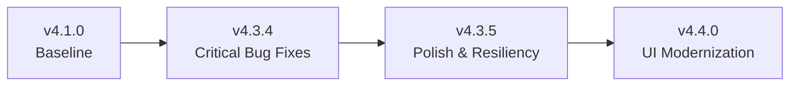

# git-user Roadmap — v4.4.0 → v4.5.0

Current version: **v4.4.0**. This plan has been updated to reflect the completion of the UI modernization and version bump to v4.4.0. The remaining objectives focus on raising unit test coverage and final milestone release audit.

---

## What Was Accomplished (v4.1.0 → v4.4.0)

```mermaid
graph LR
    A["v4.1.0\nBaseline"] --> B["v4.3.4\nCritical Bug Fixes"]
    B --> C["v4.3.5\nPolish & Resiliency"]
    C --> D["v4.4.0\nUI Modernization"]
```

### ✅ Completed Items
- [x] **[root.go](file:///Users/bobdylan/Divyo/git-user/internal/cli/root.go)**: Add `--version` / `-v` handler.
- [x] **[clone.go](file:///Users/bobdylan/Divyo/git-user/internal/cli/clone.go)**: Forward all extra git clone flags.
- [x] **[passphrase.go](file:///Users/bobdylan/Divyo/git-user/internal/cli/passphrase.go)**: Remove misleading `session start` command hints.
- [x] **[pubkey.go](file:///Users/bobdylan/Divyo/git-user/internal/cli/pubkey.go)**: Friendly access denied message.
- [x] **[tui.go](file:///Users/bobdylan/Divyo/git-user/internal/cli/tui.go)**: Skip duplicate confirmation prompts.
- [x] **[git.go](file:///Users/bobdylan/Divyo/git-user/internal/git/git.go)**: Strip embedded credentials from remote HTTPS URLs.
- [x] **[sync.go](file:///Users/bobdylan/Divyo/git-user/internal/cli/sync.go)**: Auto-recover sync repositories.
- [x] **[update.go](file:///Users/bobdylan/Divyo/git-user/internal/cli/update.go)**: Prevent Windows cross-drive file renames.
- [x] **[config.go](file:///Users/bobdylan/Divyo/git-user/internal/config/config.go)**: Eliminate array aliasing in `UnbindPathFromUser`.
- [x] **[SECURITY.md](file:///Users/bobdylan/Divyo/git-user/SECURITY.md)**: Supported versions table updated to 4.x.
- [x] **TUI Dashboard & Status HUD**: Modernized visually with Tokyo Night palette, a detailed repository status panel, rounded pill badges, and structured details cards.

---

## Current Coverage Baseline (v4.4.0)

| Package | Coverage | Status |
|---------|----------|--------|
| `internal/bundle` | **77.1%** | Target Reached |
| `internal/cli` | **47.9%** | Needs Push |
| `internal/config` | **48.9%** | Needs Push |
| `internal/git` | **45.2%** | Needs Push |
| `internal/tui/screens` | **46.0%** | Needs Push |
| `internal/tui/components` | **29.4%** | Needs Push |
| `internal/tui` (app) | **9.1%** | Needs Push |
| `internal/identity` | **31.3%** | Needs Push |
| `internal/ui` | **32.0%** | Needs Push |
| `internal/keyring` | **0.0%** ⚠️ | Needs Push |
| `internal/ssh` | **0.0%** ⚠️ | Needs Push |

---

## 📦 Remaining Release Breakdown

### Release 4 (v4.4.2): Test Coverage Push
> **Focus:** Raise test coverage across low-covered packages. Target: 60%+ average.

- [x] **`internal/keyring`**: Add mocked keyring storage backend tests (`SetKeychainPassphrase`, `GetKeychainPassphrase`, `DeleteKeychainPassphrase`).
- [x] **`internal/ssh`**: Add unit tests for `VerifyPassphrase` and `IsSSHKeyLoaded` with temporary keyfiles.
- [x] **`internal/tui`**: Expand app state and screen navigation tests in `app_test.go`.
- [x] **`internal/git`**: Test `ConvertHTTPSToSSH` with embedded credential strings.

---

## 📦 Release 5 (v4.5.0): Milestone Release & Final Audit
> **Focus:** Release readiness, cross-platform builds, final release notes.

- [x] **Cross-Platform Verification**: Verify goreleaser snapshot build compiles cleanly for all 6 target platforms.
- [x] **Release Notes & Tags**: Finalize release changelogs and prepare tags.

